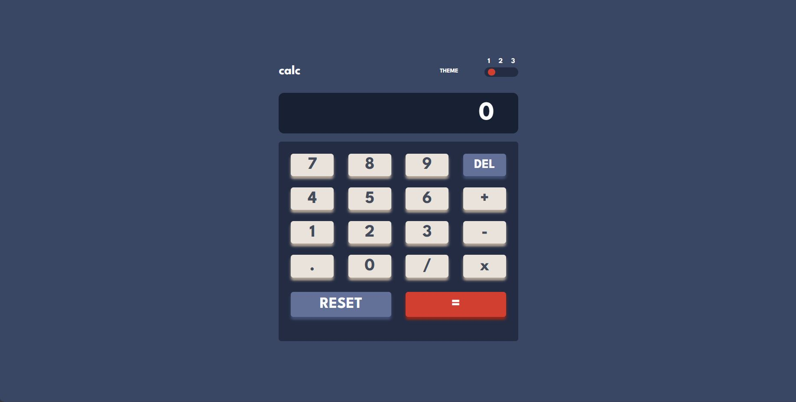
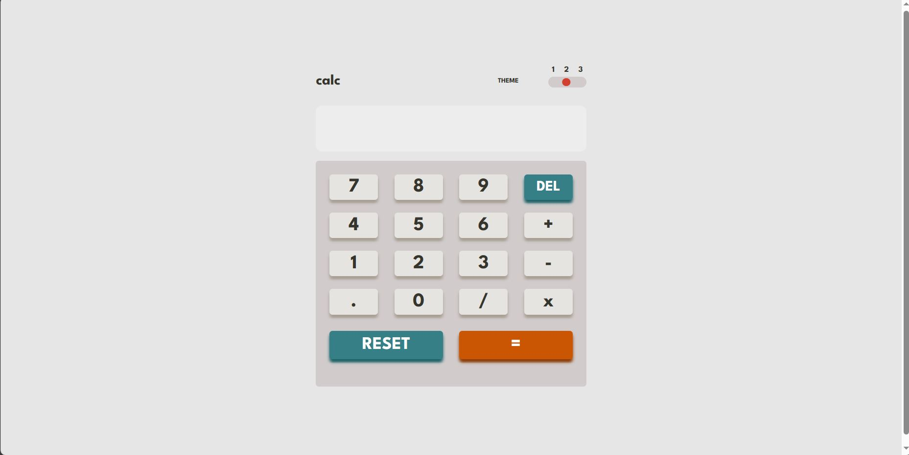
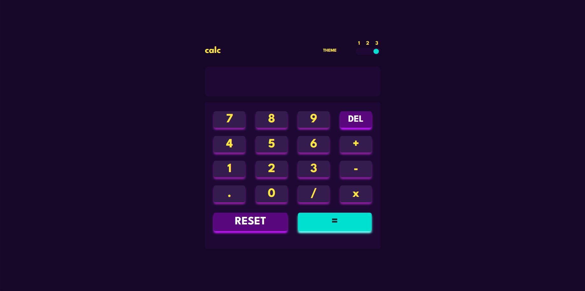
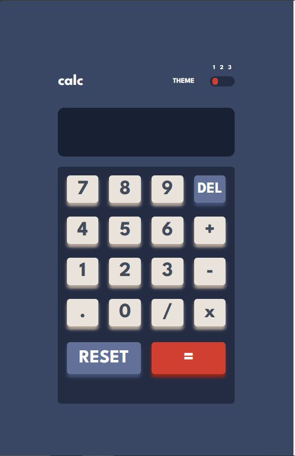

## Table of contents

- [Overview](#overview)
  - [The challenge](#the-challenge)
  - [Screenshot](#screenshot)
  - [Links](#links)
- [My process](#my-process)
  - [Built with](#built-with)
  - [What I learned](#what-i-learned)
  - [Continued development](#continued-development)
  - [Useful resources](#useful-resources)
- [Author](#author)
- [Acknowledgments](#acknowledgments)

## Overview

### The challenge

I was able to:

- See the size of the elements adjust based on their device's screen size
- Perform mathmatical operations like addition, subtraction, multiplication, and division
- Adjust the color theme based on its preference

### Screenshot

### Links

- Solution URL: [Add solution URL here](https://github.com/itstalalsalman/basic-Calculator-app)
- Live Site URL: [Add live site URL here](http://itstalalsalman.githu.io/basic-Calculator-app)

## My process

### Built with

- Semantic HTML5 markup
- CSS custom properties
- Flexbox
- CSS Grid
- Mobile-first workflow
- jQuery
- [Styled Components](https://styled-components.com/) - For styles

## Author

- Frontend Mentor - [@itstalalsalman](https://www.frontendmentor.io/profile/yourusername)
- LinkedIn : [talalsalmanzafeer](https://www.linkedin.com/in/talal-salman-zafeer-175aab248/)
